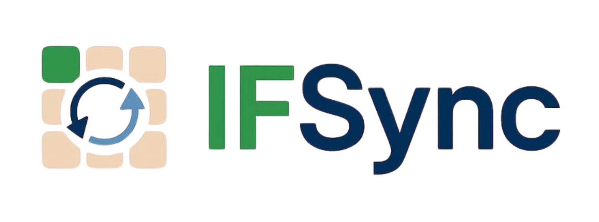

  

Plataforma acadêmica desenvolvida em **Laravel** para ajudar estudantes a organizarem sua vida acadêmica de forma prática e eficiente.

---

## 🚀 Guia de Instalação e Configuração

Este guia ensina passo a passo como configurar o ambiente de desenvolvimento no **Windows** usando **XAMPP + PHP + Composer**, para rodar o IFSync localmente.

---

## ✅ Pré-requisitos

- Windows 10 ou 11  
- Git instalado → https://git-scm.com/downloads  
  Para verificar:
    
        git --version

- XAMPP instalado → https://www.apachefriends.org/pt_br/index.html  
- Composer instalado → https://getcomposer.org/download/  

---

### 📌 Passo 1 — Instalar o XAMPP (PHP + MySQL)

- Instale o **XAMPP** com PHP 8.2+.  
- Abra o **XAMPP Control Panel**:  
- Inicie **Apache** ✅  
- Inicie **MySQL** ✅ (mesmo sem banco ainda)  

---

### 📌 Passo 2 — Configurar o PHP no PATH

- Vá até `C:\xampp\php`.  
- Copie esse caminho.  
- Acesse: **Editar variáveis de ambiente do sistema → Variáveis de Ambiente → Path → Novo → cole o caminho.**  
- Feche e reabra o terminal e teste:  

        php -v

---

### 📌 Passo 3 — Instalar o Composer

- Baixe o instalador e siga os passos.  
- Teste no terminal:  

        composer -V

---

### 📌 Passo 4 — Clonar o repositório

- No terminal, vá até a pasta desejada e execute (PowerShell):

        cd $HOME\Documents
        git clone https://github.com/nadineeev/IFSync.git
        cd IFSync

- Se estiver no **Prompt de Comando (CMD)**, use:

        cd %USERPROFILE%\Documents
        git clone https://github.com/nadineeuv/IFSync.git
        cd IFSync

- Sem Git? Baixe o ZIP em **Code → Download ZIP** e extraia.

---

### 📌 Passo 5 — Instalar dependências do Laravel

- Dentro da pasta do projeto, rode:

        composer install

---

### 📌 Passo 6 — Configurar o ambiente (.env)

O arquivo `.env` é essencial no Laravel, pois contém todas as variáveis de configuração do projeto (como conexão com banco de dados, chave da aplicação, ambiente, etc.).

- Copie o arquivo de exemplo para criar o `.env` (Windows):

        copy .env.example .env

  > Esse comando cria um novo arquivo chamado `.env` a partir do modelo `.env.example`.

- Abra o arquivo `.env` na raiz do projeto.  
  Nele você poderá configurar futuramente:
  - `APP_NAME` → nome do sistema (ex.: "IFSync")  
  - `APP_ENV` → ambiente da aplicação (`local`, `staging`, `production`)  
  - `APP_DEBUG` → modo debug (`true` ou `false`)  
  - `APP_URL` → URL base da aplicação (por padrão `http://localhost`)  
  - `DB_CONNECTION`, `DB_HOST`, `DB_PORT`, `DB_DATABASE`, `DB_USERNAME`, `DB_PASSWORD` → dados do banco de dados (quando configurarmos).  

- Agora, gere a chave da aplicação com o comando:

        php artisan key:generate

  > Esse comando cria e adiciona automaticamente uma chave segura na variável `APP_KEY` dentro do `.env`.  
  > Essa chave é usada pelo Laravel para criptografia e segurança da aplicação.

⚠️ Importante: sem esse passo o Laravel não roda corretamente, pois depende da `APP_KEY` configurada no `.env`.

---

### 📌 Passo 7 — Rodar o servidor Laravel

- Suba o servidor:

        php artisan serve

- Abra no navegador: http://localhost:8000  
- Se a porta **8000** estiver ocupada:

        php artisan serve --port=8001

---

## 🧹 Comandos úteis

- Limpar cache de views:

        php artisan view:clear

- Limpar cache de configuração:

        php artisan config:clear
        php artisan cache:clear

- Ver rotas disponíveis:

        php artisan route:list

---

## 🔎 Entendendo o Laravel (resumo)

- **Laravel** → Framework PHP baseado em **MVC**.  
- **Models** → Dados e regras.  
- **Views** → Páginas (Blade).  
- **Controllers** → Lógica das rotas.  
- **Composer** → Gerencia dependências PHP.  
- **php artisan** → Ferramenta de comandos Laravel.  
- **Node/NPM** → Não usado no IFSync ainda. Será útil futuramente para Tailwind, Vue, React ou build de assets.  

---

## ✅ Resumo (checklist rápido)

- [ ] Instalar XAMPP  
- [ ] Configurar `php -v` no terminal  
- [ ] Instalar Composer  
- [ ] Clonar repositório (`git clone`)  
- [ ] Rodar `composer install`  
- [ ] Copiar `.env` → `copy .env.example .env`  
- [ ] Gerar chave → `php artisan key:generate`  
- [ ] Subir servidor → `php artisan serve`  

---
